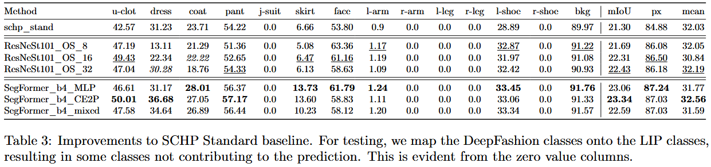
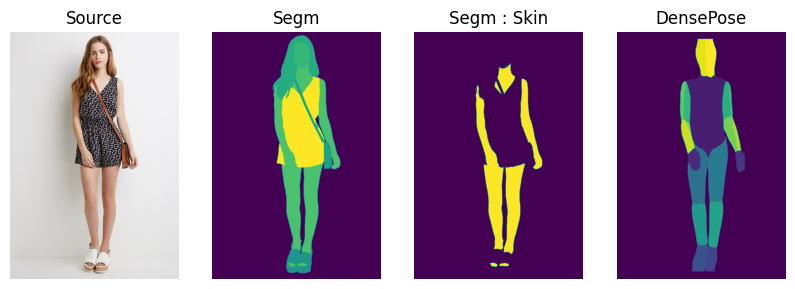
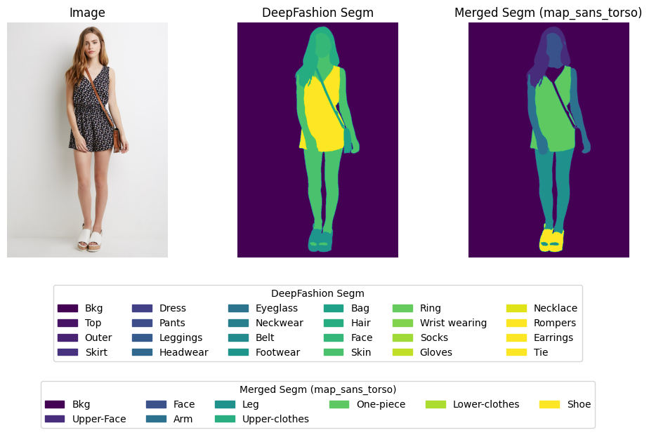
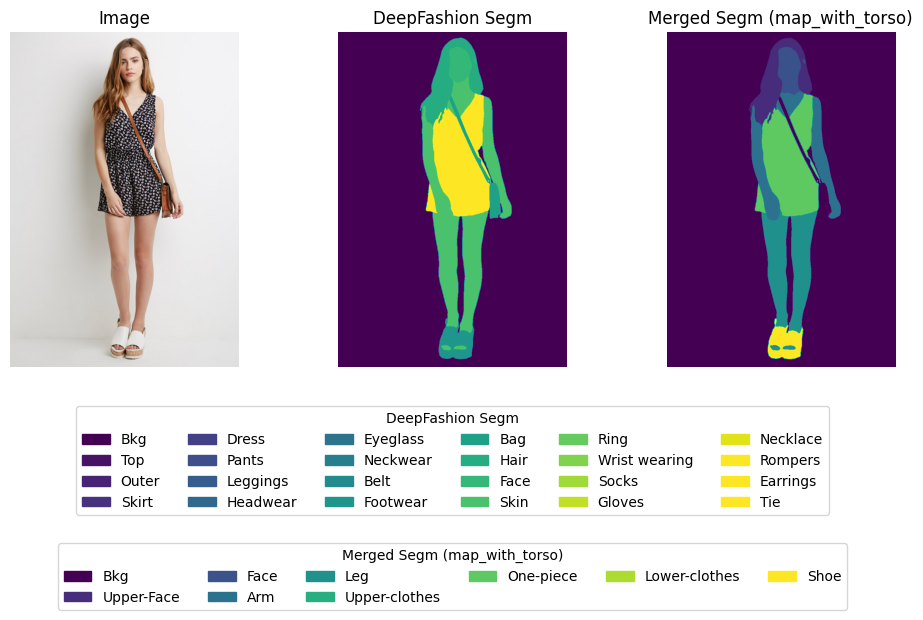
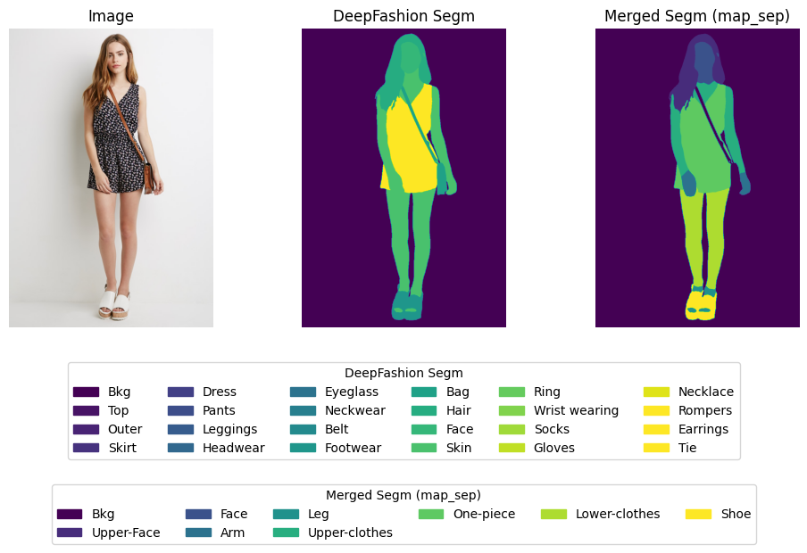

# Self Correction for Human Parsing


[](https://opensource.org/licenses/MIT)

An out-of-box human parsing representation extractor.

Our solution ranks 1st for all human parsing tracks (including single, multiple and video) in the third LIP challenge!

 

Features:
- [x] Out-of-box human parsing extractor for other downstream applications.
- [x] Pretrained model on three popular single person human parsing datasets.
- [x] Training and inferecne code.
- [x] Simple yet effective extension on multi-person and video human parsing tasks.

The following content is relevant to the work done at ViWear to produce enhanced masks. For the source README content, please visit the source repository mentioned below. 

Source Repo : [https://github.com/GoGoDuck912/Self-Correction-Human-Parsing](https://github.com/GoGoDuck912/Self-Correction-Human-Parsing)

## Setting up the Conda Env

Please follow the instructions as mentioned in the parent directory (`CatVTON_ViWear`).

## Setting up the Directory

To download the checkpoints, please download the SCHP_LIP checkpoint into the checkpoints directory.

```bash
mkdir checkpoints
cd checkpoints

gdown 1k4dllHpu0bdx38J7H28rVVLpU-kOHmnH
```

We mainly use two datasets for training or finetuning, which are both put in the `data` directory:

- LIP Dataset : To download the LIP dataset, please follow the instructions as provided in the source repository ( [https://github.com/GoGoDuck912/Self-Correction-Human-Parsing](https://github.com/GoGoDuck912/Self-Correction-Human-Parsing) ). If the download link is crashed, please consult the issues section. Please download this into the `data/LIP` directory.

- DeepFashion-MultiModal Dataset : To download the DeepFashion-MultiModal dataset, please refer to the relevant repository ( [https://github.com/yumingj/DeepFashion-MultiModal](https://github.com/yumingj/DeepFashion-MultiModal) ). Note that we only require the image, parsing and densepose subcategories. Please download this into the `data/DeepFashion_Multi` directory.

## Preprocessing Dataset : DeepFashion

DeepFashion contains 24 class labels, more than the LIP class set. Hence, we map the DeepFashion labels to that of LIP or even a new kind of mapping that aligns more with CatVTON's expected labels. We provide three different class mapping schemes, stored in the `mappings` directory:

- `map_sans_torso` : Maps DeepFashion labels (in Segmentation and DensePose) to a set of classes aligning with LIP. Note that LIP does not account for torso, and is mapping to the background, which is maintained in this mapping too.

- `map_with_torso.yaml` : Similar to `map_sans_torso`, but maps the torso region (obtained using the DensePose labels) to the class "Upper-Body".

- `map_sep.yaml` : Aligns more with CatVTON's expected labelling scheme, where we separate the (hands vs arms) and (feet vs legs). Note that torso is included in this mapping scheme. 

For a better visual understanding of these mapping schemes, please refer to the visualization section at the end. For a more interactive understanding, please refer to the `deepfashion_mapping.ipynb` notebook.


Using either of the mapping schemes, we can generate a dataset (subset) which contains samples that follow these new class labels. Such a dataset can then be leveraged for more optimal finetuning.

```bash
python -m preprocess_deepfashion \
--mapping_cfg mappings/df_map_sep.yaml \
--dest_data_dir data/DeepFashion_Multi/DeepFashion_map_sep \
--num_train_samples 2500
```


## Training

For training the model, we first train on the general LIP dataset, after which we finetune on the DeepFashion dataset to zero-in on the try-on mask generation. We train on a subset of labels, ensuring proper mapping from the standard LIP labels onto the subset of merged labels. The mapping scheme can be found in `mappings/lip_map.yaml`.

### LIP Training

```bash
python train.py \
--arch segformer_mit_b4 \
--batch-size 4 \
--input-size 512,384 \
--learning-rate 6e-5 \
--weight-decay 1e-2 \
--gpu 0 \
--imagenet-pretrain ./pretrain_model/mit_b4.pth \
--log-dir ./log/segformer_big/lip_train \
--num_samples 2500 \
--optimizer adamw_custom \
--do_mapping \
--lip_map_cfg mappings.lip_map.yaml \
--num-classes 9
```

### DeepFashion Finetuning

Finetuning on DeepFashion is done in two stages, ensuring gradual unfreezing of the layers, aided with layer-based learning rates. This is done in two stages.

#### Stage 1

Here, the backbone (MiT) is frozen, while the other modules (Decoder, Edge, Fusion) are unfrozen. This is run till convergence, after which 1 SCHP cycle is run.


```bash
python train.py \
--arch segformer_mit_b4 \
--batch-size 4 \
--input-size 512,384 \
--learning-rate 6e-5 \
--weight-decay 1e-3 \
--gpu 0 \
--imagenet-pretrain ./pretrain_model/mit_b4.pth \
--log-dir ./log/segformer_big/finetune_phase_1 \
--num_samples 2500 \
--optimizer segce2p_phase_1 \
--model-restore ./log/segformer_big/lip_train/schp_4_checkpoint.pth.tar \
--schp-restore ./log/segformer_big/lip_train/schp_4_checkpoint.pth.tar \
--reset_schp_cycle \
--data-dir ./data/DeepFashion_Multi/DeepFashion_merged/ \
--num-classes 9
```

#### Stage 2

Here, all modules are unfrozen, with the backbone receiving a learning rate 10x lower than the other modules (Decoder, Edge, Fusion). This is run till convergence, after which 5 SCHP cycles are run.


```bash
python train.py \
--arch segformer_mit_b4 \
--batch-size 4 \
--input-size 512,384 \
--learning-rate 6e-5 \
--weight-decay 1e-3 \
--gpu 0 \
--imagenet-pretrain ./pretrain_model/mit_b4.pth \
--log-dir ./log/segformer_big/finetune_phase_2 \
--num_samples 2500 \
--optimizer segce2p_phase_2 \
--model-restore ./log/segformer_big/finetune_phase_1/schp_3_checkpoint.pth.tar \
--schp-restore ./log/segformer_big/finetune_phase_1/schp_3_checkpoint.pth.tar \
--reset_schp_cycle \
--data-dir ./data/DeepFashion_Multi/DeepFashion_merged/ \
--num-classes 9
```

## Evaluation

To evaluate on the LIP dataset:

```bash
python -m evaluate \
--arch segformer_mit_b4 \
--data-dir data/LIP/ \
--input-size 512,384 \
--num-classes 9 \
--log-dir ./log/eval_results/lip/segformer_big \
--model-restore ./log/segformer_big/lip_train/schp_6_checkpoint.pth.tar
--do-lip-mapping \
--lip-map-cfg mappings/lip_map.yaml
```


To evaluate on the DeepFashion dataset:

```bash
python -m evaluate \
--arch segformer_mit_b4 \
--data-dir data/DeepFashion_Multi/DeepFashion_sep/ \
--input-size 512,384 \
--num-classes 9 \
--log-dir ./log/eval_results/segformer_big/df_finetune/ \
--model-restore ./log/segformer_big/map_sep/df_finetune/finetune_torso_phase_2/schp_6_checkpoint.pth.tar
```


Experimenting with different model architectures and backbones, we finally decided to adopt the SegFormer as the main backbone, with a few minor changes to the rest of the pipeline. Some initial results (before mapping to merged classes) are shown below.



The optimal configuration (SegFormer_b4_MLP) was chosen as it provided one the best results, while being the most lightweight among its group. This was then properly trained and finetuned on the merged class labels.


## Visualization

### DeepFashion-MultiModal Data Sample



### Mapping Schemes

Scheme : map_sans_torso


Scheme : map_with_torso


Scheme : map_sep

